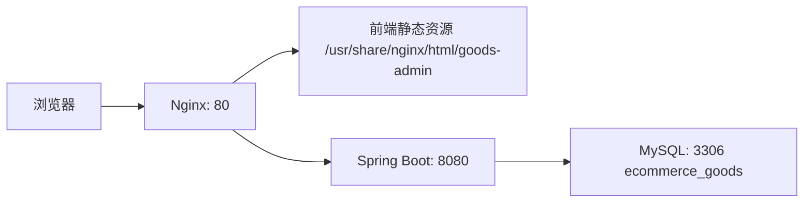

# Linux 部署说明

## 1. 部署架构



## 2. 服务器环境要求

| 软件 | 建议版本 |
| --- | --- |
| Linux | Ubuntu 22.04 / CentOS 7+ |
| JDK | 17+ |
| Maven | 3.8+ |
| Node.js | 20+ |
| MySQL | 8.x |
| Nginx | 1.20+ |

## 3. MySQL 初始化

```bash
mysql -u root -p123456 -e "CREATE DATABASE IF NOT EXISTS ecommerce_goods DEFAULT CHARACTER SET utf8mb4 COLLATE utf8mb4_unicode_ci;"
mysql -u root -p123456 ecommerce_goods < backend/src/main/resources/schema.sql
```

如数据库密码不同，请修改 `backend/src/main/resources/application.yml`。

## 4. 后端打包与部署

在项目根目录执行：

```bash
cd backend
mvn clean package -DskipTests
```

上传 jar 到服务器：

```bash
sudo mkdir -p /opt/goods-admin/backend
sudo cp target/goods-management-backend-1.0.0.jar /opt/goods-admin/backend/app.jar
```

复制 systemd 服务：

```bash
sudo cp deploy/systemd/goods-admin-backend.service /etc/systemd/system/goods-admin-backend.service
sudo systemctl daemon-reload
sudo systemctl enable goods-admin-backend
sudo systemctl start goods-admin-backend
sudo systemctl status goods-admin-backend
```

## 5. 前端打包与部署

```bash
cd frontend
npm install
npm run build
```

上传前端静态资源：

```bash
sudo mkdir -p /usr/share/nginx/html/goods-admin
sudo cp -r dist/* /usr/share/nginx/html/goods-admin/
```

## 6. Nginx 配置

复制配置文件：

```bash
sudo cp deploy/nginx/goods-admin.conf /etc/nginx/conf.d/goods-admin.conf
sudo nginx -t
sudo systemctl reload nginx
```

访问地址：

```text
http://服务器IP/
```

## 7. 一键部署脚本

项目提供 `deploy/scripts/deploy-linux.sh`，适合在 Linux 服务器项目根目录执行：

```bash
chmod +x deploy/scripts/deploy-linux.sh
sudo ./deploy/scripts/deploy-linux.sh
```

脚本会构建前端、构建后端、复制 jar、复制前端静态资源、安装 systemd 和 Nginx 配置，并重启服务。

## 8. 常用运维命令

查看后端日志：

```bash
journalctl -u goods-admin-backend -f
```

重启后端：

```bash
sudo systemctl restart goods-admin-backend
```

重载 Nginx：

```bash
sudo nginx -t && sudo systemctl reload nginx
```

检查端口：

```bash
ss -lntp | grep -E '80|8080|3306'
```

