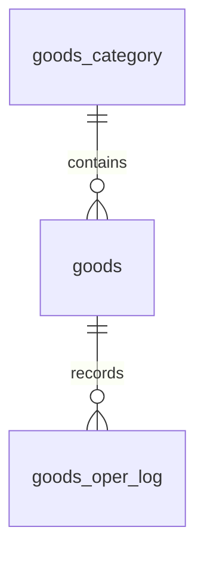

# 商品管理模块数据库设计

## 1. 设计目标

数据库围绕商品主数据、商品分类、操作日志三类信息设计，满足商品分页查询、状态流转、库存预警、批量导入导出、操作审计等业务需求。

## 2. 表关系

## 3. 商品分类表 goods_category

| 字段名 | 类型 | 约束 | 说明 |
| --- | --- | --- | --- |
| id | bigint | PK, auto_increment | 分类 ID |
| parent_id | bigint | not null, default 0 | 父分类 ID，0 表示一级分类 |
| category_name | varchar(100) | not null | 分类名称 |
| sort_no | int | not null, default 0 | 排序 |
| status | tinyint | not null, default 1 | 0 禁用，1 启用 |
| create_time | datetime | not null | 创建时间 |
| update_time | datetime | not null | 更新时间 |

索引：

- idx_category_parent(parent_id)
- idx_category_status(status)

## 4. 商品主表 goods

| 字段名 | 类型 | 约束 | 说明 |
| --- | --- | --- | --- |
| id | bigint | PK, auto_increment | 商品 ID |
| spu_code | varchar(64) | not null, unique | SPU 编码 |
| goods_name | varchar(255) | not null | 商品名称 |
| category_id | bigint | not null | 分类 ID |
| price | decimal(10,2) | null | 商品售价 |
| stock_num | int | not null, default 0 | 当前库存 |
| status | tinyint | not null, default 0 | 0 待审核，1 已上架，2 已下架 |
| main_img | varchar(500) | null | 商品主图地址 |
| description | text | null | 商品详情 |
| warn_stock | int | null | 商品独立预警库存 |
| is_delete | tinyint | not null, default 0 | 0 正常，1 删除 |
| create_time | datetime | not null | 创建时间 |
| update_time | datetime | not null | 更新时间 |

索引：

- uk_goods_spu(spu_code)
- idx_goods_status(status)
- idx_goods_category(category_id)
- idx_goods_create_time(create_time)
- idx_goods_stock(stock_num)
- idx_goods_deleted(is_delete)

设计说明：

- 采用逻辑删除，删除商品不会物理移除记录；
- spu_code 全局唯一，用于导入校验和业务追踪；
- warn_stock 为空时使用系统默认阈值；
- status 只表示商品生命周期状态，库存预警由 stock_num 与 warn_stock 动态计算。

## 5. 商品操作日志表 goods_oper_log

| 字段名 | 类型 | 约束 | 说明 |
| --- | --- | --- | --- |
| id | bigint | PK, auto_increment | 日志 ID |
| goods_id | bigint | null | 商品 ID，批量导入可为空 |
| spu_code | varchar(64) | null | SPU 编码 |
| oper_type | varchar(50) | not null | CREATE、UPDATE、STATUS、STOCK、DELETE、IMPORT、EXPORT |
| oper_content | varchar(1000) | not null | 操作内容 |
| operator | varchar(64) | not null | 操作人 |
| oper_time | datetime | not null | 操作时间 |

索引：

- idx_log_goods(goods_id)
- idx_log_spu(spu_code)
- idx_log_type(oper_type)
- idx_log_time(oper_time)

## 6. 建表脚本

完整 SQL 见 `backend/src/main/resources/schema.sql`。

## 7. 状态与枚举

### 商品状态

| 值 | 名称 | 说明 |
| --- | --- | --- |
| 0 | 待审核 | 新建或下架后重新提交 |
| 1 | 已上架 | 商城前端可见 |
| 2 | 已下架 | 商城前端隐藏 |

### 库存状态

| 编码 | 计算方式 |
| --- | --- |
| normal | stock_num > warn_stock |
| warning | stock_num <= warn_stock 且 stock_num > 0 |
| empty | stock_num <= 0 |

