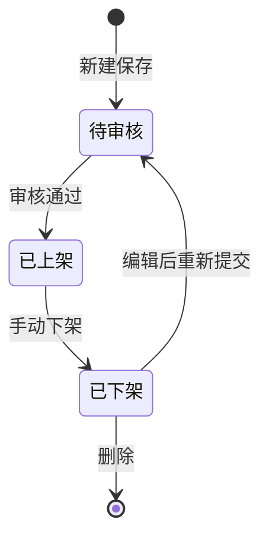

# 商品管理模块需求规约

## 1. 文档说明

### 1.1 文档目的

本文档定义电商后台商品管理模块的业务需求、功能规则、界面交互、数据统计、权限约束和验收标准，为前端开发、后端接口设计、数据库表设计、测试用例编写提供统一依据。

### 1.2 适用范围

适用于电商运营后台管理系统的商品全生命周期管理，包括商品新增、编辑、上下架、审核、库存管理、批量导入导出、筛选查询、数据看板统计和商品删除。

### 1.3 读者对象

产品经理、前端开发、后端开发、测试工程师、数据库设计人员、运维人员、运营人员。

### 1.4 术语定义

| 术语 | 说明 |
| --- | --- |
| SPU | 标准化产品单元，一款商品的基础编码，唯一标识商品 |
| 商品状态 | 待审核、已上架、已下架 |
| 库存预警 | 商品库存低于或等于预警阈值时自动标记 |
| 批量操作 | 批量导入、导出、上下架、库存调整、删除 |
| 商品分类 | 一级、二级分类，关联分类管理模块 |

## 2. 整体业务概述

商品管理模块是电商后台的核心基础模块，负责维护平台所有在售、待审、下架商品。模块支持单条商品维护、多条件筛选检索、批量数据处理、商品数据看板统计，并与分类管理、库存管理、订单管理和系统设置联动，完成商品上架审核、价格、库存、基础信息等全流程管控。

## 3. 功能性需求

### 3.1 页面整体布局

页面采用后台管理系统常见的三栏结构。

| 区域 | 内容 |
| --- | --- |
| 左侧导航 | 首页、商品管理、分类管理、库存管理、订单管理、系统设置。商品管理高亮展示 |
| 顶部导航 | 系统名称、当前页面标题、搜索商品、新建商品、批量导入、Excel 导出 |
| 中间主区域 | 高级筛选、快捷筛选标签、商品表格、批量操作栏、分页 |
| 右侧看板 | 全部商品、已上架/待审核、库存预警三张统计卡片 |

### 3.2 筛选查询

高级筛选支持组合查询和重置。

| 条件 | 说明 |
| --- | --- |
| 商品状态 | 全部、待审核、已上架、已下架 |
| 关键词 | 匹配商品名称和 SPU 编码 |
| 商品分类 | 加载分类管理模块分类下拉数据 |
| 库存状态 | 全部、正常、库存预警、无库存 |
| 创建时间 | 起止日期区间筛选 |

快捷筛选标签包括：筛选、关键词搜索、商品分类、商品类型、价格区间、库存状态、上下架。

### 3.3 商品列表

| 列名 | 说明 |
| --- | --- |
| 复选框 | 单选或全选，用于批量操作 |
| 商品信息 | 商品缩略图、商品名称、状态标签 |
| SPU 编码 | 商品唯一编码 |
| 分类 | 展示一级/二级分类名称 |
| 价格 | 商品售价，无价格显示 “-” |
| 库存 | 当前库存，支持 0 和负数展示 |
| 状态 | 彩色标签展示商品状态 |
| 创建时间 | 格式为 YYYY-MM-DD |
| 操作 | 编辑、上下架、库存、删除 |

状态颜色规则：

| 状态 | 颜色 |
| --- | --- |
| 已上架 | 绿色 |
| 待审核 | 黄色 |
| 库存预警 | 红色 |
| 已下架 | 灰色 |

### 3.4 单行操作

| 操作 | 规则 |
| --- | --- |
| 编辑 | 打开编辑弹窗，支持修改基础信息 |
| 上下架 | 已上架可下架，已下架重新提交为待审核，待审核审核通过后上架 |
| 库存 | 打开库存调整弹窗 |
| 删除 | 弹出二次确认。已上架商品需高危确认 |

### 3.5 批量操作

勾选多条商品后激活底部批量操作栏。

| 操作 | 规则 |
| --- | --- |
| 批量编辑 | 批量修改部分基础字段 |
| 批量库存 | 批量调整选中商品库存 |
| 批量下架 | 批量将选中商品改为已下架 |
| 批量删除 | 二次确认后逻辑删除 |
| 分页 | 支持 5、10、20、50 条每页 |

### 3.6 顶部快捷按钮

| 按钮 | 功能 |
| --- | --- |
| 搜索商品 | 聚焦关键词搜索框并触发检索 |
| 新建商品 | 打开新增商品弹窗 |
| 批量导入 | 下载模板或上传 Excel 导入 |
| Excel 导出 | 导出当前筛选条件下的商品数据 |

### 3.7 统计看板

| 统计项 | 计算规则 |
| --- | --- |
| 全部商品 | goods 表正常商品总数 |
| 已上架 | status = 1 的商品数量 |
| 待审核 | status = 0 的商品数量 |
| 库存预警 | stock_num <= warn_stock 或全局阈值的商品数量 |

新增、编辑、删除、导入、库存调整、上下架后应自动刷新统计。

### 3.8 商品状态流转

业务规则：

- 新建商品默认状态为待审核；
- 待审核通过后变为已上架；
- 已上架下架后商城前端隐藏；
- 已下架商品重新编辑后进入待审核；
- 已上架商品删除前必须二次确认。

### 3.9 库存预警

系统设置中维护全局库存预警阈值，商品也可设置独立预警阈值。商品库存小于等于有效阈值时进入库存预警列表。

## 4. 非功能性需求

| 类型 | 要求 |
| --- | --- |
| 性能 | 分页查询响应不超过 500ms；导出 1 万条不超过 10s；导入 1000 条不超过 8s |
| 兼容性 | 前端兼容 Chrome、Edge；导入导出兼容 xlsx、xls |
| 安全 | 运营/管理员可见；普通员工隐藏删除和导入；删除二次确认；记录操作日志 |
| 易用性 | 筛选可组合、可重置；状态清晰；导入错误给出行号和原因 |

## 5. 接口需求

| 接口 | 方法 | 路径 |
| --- | --- | --- |
| 分页查询商品 | GET | /api/goods |
| 获取统计看板 | GET | /api/goods/stats |
| 新增商品 | POST | /api/goods |
| 编辑商品 | PUT | /api/goods/{id} |
| 修改状态 | PATCH | /api/goods/{id}/status |
| 批量修改状态 | PATCH | /api/goods/status |
| 删除商品 | DELETE | /api/goods/{id} |
| 批量删除 | DELETE | /api/goods |
| 修改库存 | PATCH | /api/goods/{id}/stock |
| 批量修改库存 | PATCH | /api/goods/stock |
| 下载导入模板 | GET | /api/goods/import-template |
| Excel 导入 | POST | /api/goods/import |
| Excel 导出 | GET | /api/goods/export |
| 分类下拉 | GET | /api/categories |

## 6. 验收标准

- 页面菜单、顶部按钮、表格和右侧统计看板展示正常；
- 筛选条件可单独查询和组合查询，重置功能生效；
- 新建、编辑、上下架、库存调整、删除流程正常；
- 勾选商品后批量操作可用；
- Excel 模板下载、导入校验、商品导出可正常执行；
- 统计数值随增删改实时刷新；
- 商品状态流转符合业务规则；
- 库存预警标记生效；
- 操作日志记录操作人、操作时间、操作内容；
- 分页加载流畅，接口响应符合性能要求。

