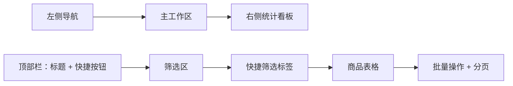

# 商品管理模块界面 UI 设计

## 1. 设计目标

界面定位为电商运营后台工具，强调信息密度、扫描效率、状态识别和批量处理效率。整体风格采用清爽的后台管理布局，不做营销式首页，进入页面即展示商品管理工作台。

## 2. 页面布局

## 3. 左侧导航

宽度 220px，深色背景，当前“商品管理”高亮。

菜单项：

- 首页
- 商品管理
- 分类管理
- 库存管理
- 订单管理
- 系统设置

## 4. 顶部导航

顶部栏高度 64px，展示系统名称、当前页面标题和快捷按钮。

快捷按钮：

| 按钮 | 样式 | 行为 |
| --- | --- | --- |
| 搜索商品 | 次要按钮 | 聚焦关键词输入框 |
| 新建商品 | 主按钮 | 打开新增弹窗 |
| 批量导入 | 次要按钮 | 打开导入弹窗 |
| Excel 导出 | 次要按钮 | 下载当前筛选数据 |

## 5. 筛选区

筛选区采用两行栅格布局，桌面端每行 4 到 5 个控件。

控件：

- 商品状态下拉
- 关键词输入
- 商品分类下拉
- 库存状态下拉
- 创建时间范围
- 查询按钮
- 重置按钮

## 6. 快捷筛选标签

以轻量标签按钮展示，点击后快速填充筛选条件或聚焦对应输入项。

标签：筛选、关键词搜索、商品分类、商品类型、价格区间、库存状态、上下架。

## 7. 商品表格

表格为页面主内容，固定展示核心列。

商品信息列：

- 左侧缩略图，尺寸 48px；
- 右侧商品名；
- 下方展示状态或库存预警标签。

状态标签：

| 状态 | Element Plus 类型 | 色彩含义 |
| --- | --- | --- |
| 已上架 | success | 可售 |
| 待审核 | warning | 等待运营处理 |
| 已下架 | info | 不可售 |
| 库存预警 | danger | 需要补货 |

操作列：

- 编辑
- 上架/下架/审核通过
- 库存
- 删除

## 8. 右侧统计看板

宽度 280px，展示三张统计卡片：

| 卡片 | 图标 | 说明 |
| --- | --- | --- |
| 全部商品 | Check | 商品总数 |
| 已上架/待审核 | Warning | 上架数量和待审核数量 |
| 库存预警 | WarningFilled | 库存低于阈值商品数量 |

统计看板在筛选、新增、编辑、删除、库存调整后刷新。

## 9. 弹窗设计

### 9.1 新建/编辑商品弹窗

字段：

- 商品名称
- SPU 编码
- 商品分类
- 价格
- 库存
- 预警库存
- 主图地址
- 商品详情

新建商品保存后默认进入待审核状态。

### 9.2 库存调整弹窗

展示当前商品名称与现有库存，输入新库存值后保存。

### 9.3 批量导入弹窗

支持下载模板和上传 Excel 文件。上传后展示导入结果：成功数量、失败数量、失败行原因。

## 10. 响应式规则

- 宽屏：左侧导航 + 主区 + 右侧看板三列展示；
- 中屏：右侧看板仍展示，但宽度压缩；
- 小屏：右侧看板移至主区上方，筛选项换行展示；
- 表格横向滚动，保证所有字段可访问。

